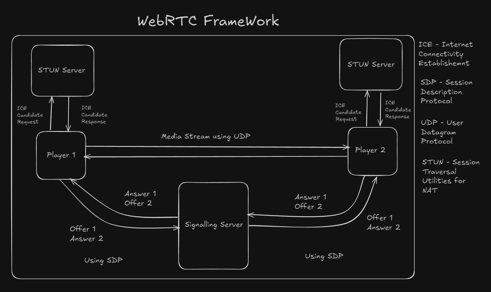
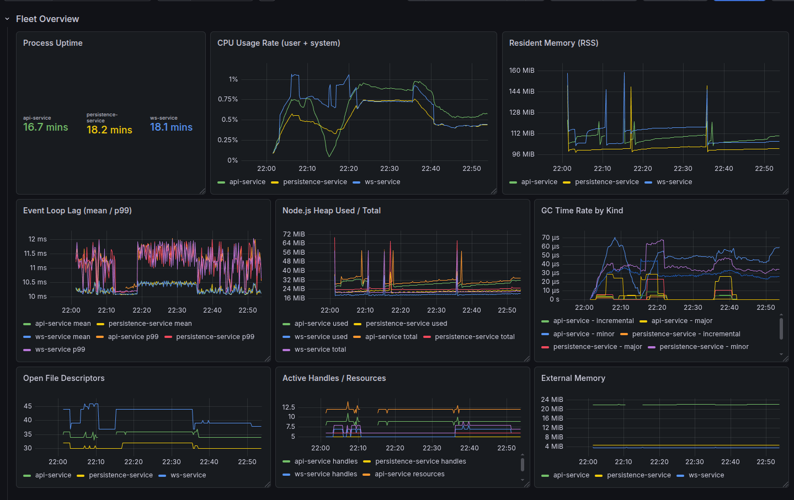
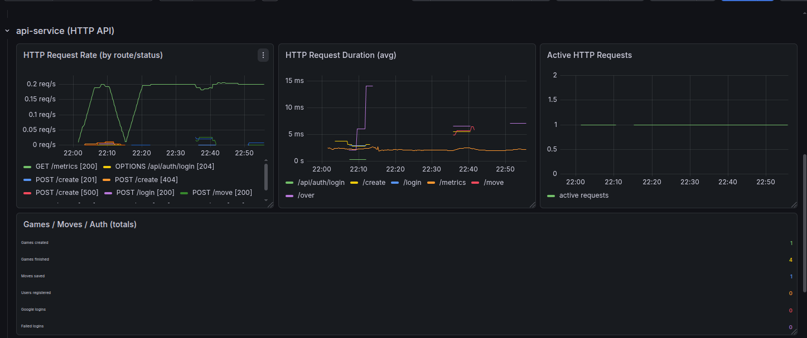
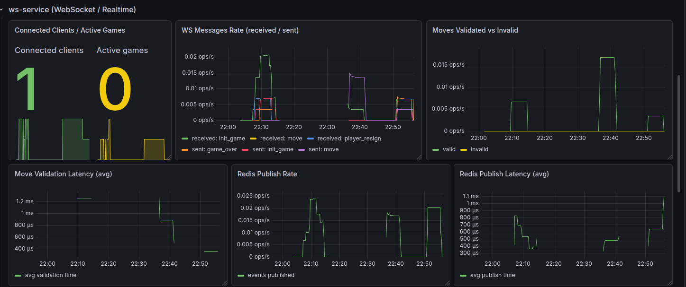
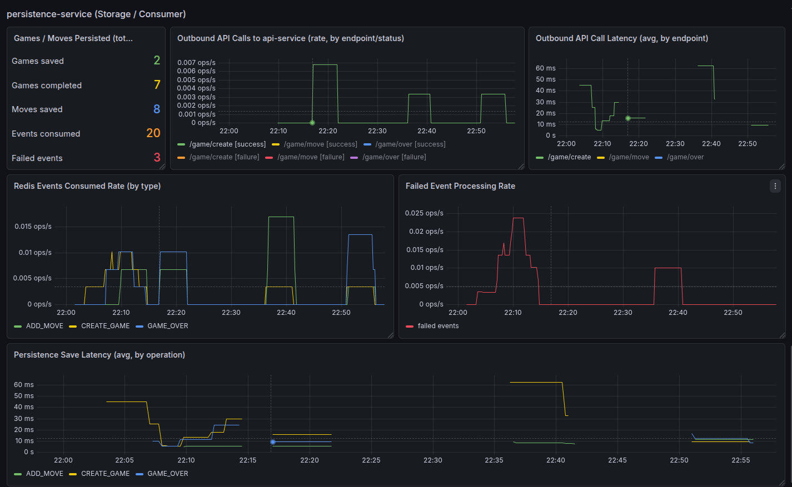
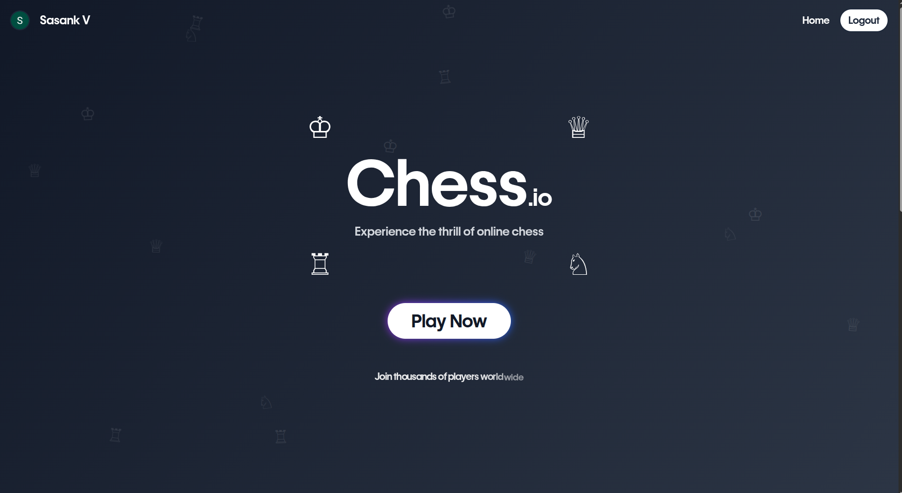
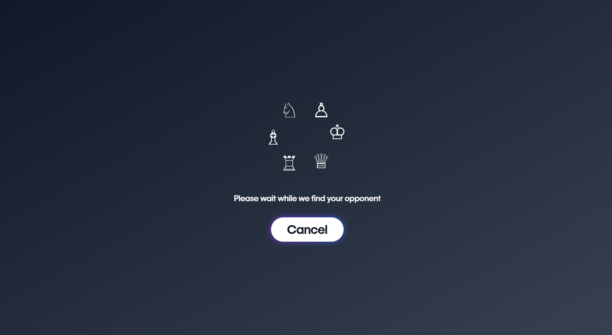
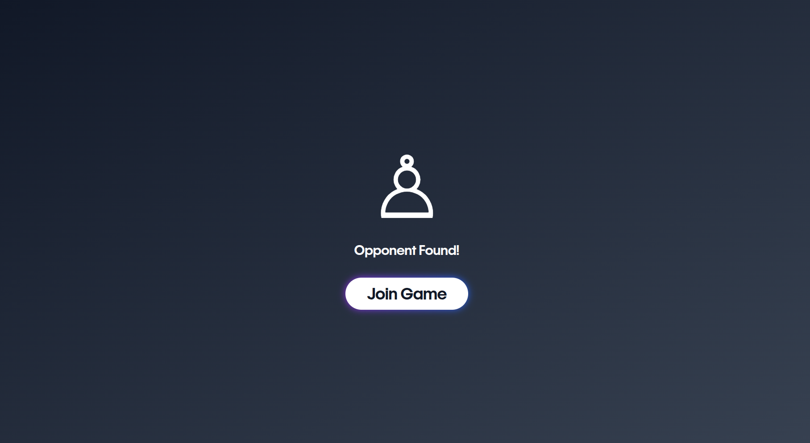
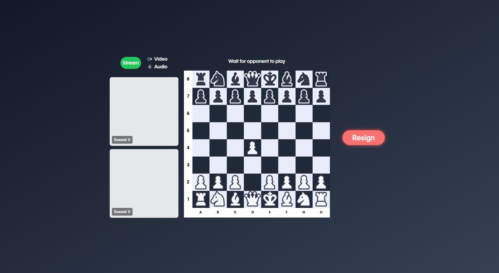
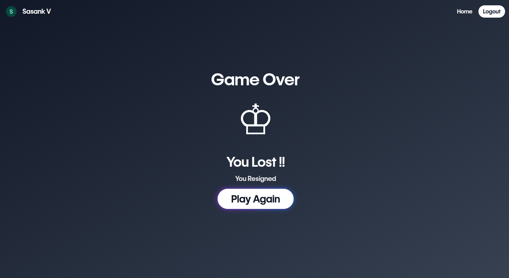

# Chess.io

> A production-oriented real-time multiplayer chess platform built using a service-oriented architecture, event-driven persistence, React, Node.js, WebSockets, Redis Streams, MongoDB, pnpm Workspaces, and Turborepo.

Chess.io is designed as a modular backend composed of independent services communicating through well-defined APIs and asynchronous events. The architecture separates real-time gameplay from database persistence, making the system easier to extend, maintain, and scale.

---

# Features

- Real-time multiplayer chess using WebSockets
- Server-authoritative move validation using `chess.js`
- Event-driven persistence with Redis Streams
- Asynchronous game persistence service
- User authentication with Google OAuth
- Persistent game history and move storage
- Matchmaking and game session management
- Game replay support
- Resignation and game-over handling
- Shared TypeScript contracts across all services
- Monorepo powered by pnpm Workspaces and Turborepo

---

# Current Architecture

## Services

### Web Client

- React
- Vite
- Tailwind CSS
- TypeScript

### API Service

Responsible for:

- Authentication
- User management
- Game retrieval
- Match history
- Profile APIs

### WebSocket Service

Responsible for:

- Matchmaking
- Live gameplay
- Move validation
- Session management
- Publishing game events

### Persistence Service

Responsible for:

- Consuming game events from Redis Streams
- Persisting games and moves
- Updating completed matches
- Decoupling gameplay from database operations

---

# Architecture Overview

```text
                              +----------------------+
                              |     React Client     |
                              +----------+-----------+
                                         |
                     +-------------------+-------------------+
                     |                                       |
                     ▼                                       ▼
          +----------------------+              +----------------------+
          |     API Service      |              |    WebSocket Service |
          |----------------------|              |----------------------|
          | Google OAuth         |              | Matchmaking          |
          | User Management      |              | Live Gameplay        |
          | Game Persistence API |              | Move Validation      |
          | Profile APIs         |              | Session Management   |
          +----------+-----------+              | Publish Game Events  |
                     ▲                          +----------+-----------+
                     |                                     |
                     |                                     |
                     |                          XADD mq:game-events
                     |                                     |
                     |                                     ▼
                     |                     +-------------------------------+
                     |                     |         Redis Streams         |
                     |                     |      mq:game-events           |
                     |                     +---------------+---------------+
                     |                                     |
                     |                              XREAD BLOCK
                     |                                     |
                     |                                     ▼
                     |                     +-------------------------------+
                     |                     |     Persistence Service       |
                     |                     |-------------------------------|
                     |                     | Consume Game Events           |
                     |                     | Transform Events              |
                     |                     | Call API Service              |
                     |                     +---------------+---------------+
                     |                                     |
                     +------------- HTTP REST -------------+
                                           |
                                           ▼
                                   +---------------+
                                   |   MongoDB     |
                                   +---------------+

                 Shared Packages
      (API Contracts • WebSocket Messages • Game Events)
```

## WebRTC Overview



---

# Event-Driven Persistence

The WebSocket service is optimized exclusively for low-latency gameplay.

Instead of writing directly to MongoDB, it publishes events to a Redis Stream.

Examples of events include:

- Game Created
- Move Played
- Game Finished

The Persistence Service consumes these events independently and updates the database asynchronously.

This architecture provides:

- Loose coupling
- Faster gameplay response
- Independent scaling
- Improved fault isolation
- Easier integration of additional consumers (analytics, notifications, leaderboards, etc.)

---

# Repository Structure

```text
Chess.io/

apps/
├── api-service/
├── persistence-service/
├── web-client/
└── ws-service/

packages/
└── shared-types/
```

---

# Project Structure

```text
apps/

api-service/
├── controllers/
├── middleware/
├── models/
├── routes/
└── src/

ws-service/
├── core/
├── queue/
├── repositories/
├── services/
├── websocket/
└── src/

persistence-service/
├── consumers/
├── repositories/
├── services/
└── src/

web-client/
├── components/
├── context/
├── hooks/
├── screens/
└── src/

packages/

shared-types/
├── api/
├── events/
└── websocket/
```

---

# Tech Stack

## Frontend

- React
- TypeScript
- Vite
- Tailwind CSS

## Backend

- Node.js
- Express
- WebSocket (`ws`)
- MongoDB
- Mongoose

## Messaging

- Redis
- Redis Streams

## Monorepo

- pnpm Workspaces
- Turborepo
- TypeScript Project References

---

# Game Flow

1. Two players connect to the WebSocket service.
2. Matchmaking pairs waiting players.
3. A game session is created in memory.
4. Players exchange moves over WebSockets.
5. Every move is validated using `chess.js`.
6. The WebSocket service publishes game events to Redis Streams.
7. The Persistence Service consumes events asynchronously.
8. MongoDB is updated with the latest game state.
9. Opponents receive updates immediately without waiting for database writes.

---

# Engineering Decisions

- Server-authoritative game engine
- Event-driven persistence
- Asynchronous database writes
- Stateless REST API
- Stateful WebSocket gateway
- Redis Streams as an event queue
- Shared TypeScript contracts
- Repository pattern
- Service-oriented architecture

---

# Monitoring and Observability

Chess.io includes Prometheus and Grafana for local observability and dashboarding.

## Metrics Endpoints

Each backend service exposes Prometheus metrics at `/metrics`:

- API Service: `http://localhost:3000/metrics`
- WebSocket Service: `http://localhost:8080/metrics`
- Persistence Service: `http://localhost:4000/metrics`

These metrics are powered by `prom-client` and include default Node.js process metrics plus service-specific counters and histograms for authentication, HTTP traffic, Redis activity, WebSocket traffic, and persistence operations.

## Prometheus

Prometheus is configured in [`monitoring/prometheus.yml`](monitoring/prometheus.yml) and scrapes the backend services every 5 seconds.

The Docker Compose network targets are:

- `dev:3000` for the API Service
- `dev:8080` for the WebSocket Service
- `dev:4000` for the Persistence Service

## Grafana

Grafana is available in the compose stack for dashboards and visualization.

- Grafana UI: `http://localhost:3001`
- Prometheus UI: `http://localhost:9090`

## Grafana Dashboard Screenshots






Use Grafana to create dashboards from the Prometheus data source and track request throughput, Redis usage, WebSocket activity, and persistence latency over time.

## Web Client Screenshots







# Environment Variables

## API Service

```env
PORT=3000
MONGODB_URL=
CLIENT_URL=
JWTSECRET_KEY=
MAILER_AUTH_USER=
MAILER_AUTH_PASS=
NODE_ENV=
ACCESS_TOKEN_EXPIRY=1h
REFRESH_TOKEN_EXPIRY=1d
```

---

## WebSocket Service

```env
PORT=8080
API_SERVICE_URL=http://api-service:3000/api
REDIS_URL=redis://redis:6379
```

---

## Persistence Service

```env
API_SERVICE_URL=http://api-service:3000/api
REDIS_URL=redis://redis:6379
```

---

## Web Client

```env
VITE_API_SERVICE_URL=http://localhost:3000/api
VITE_WS_SERVICE_URL=ws://localhost:8080
VITE_OAUTH_CLIENT_ID=
```

---

# Running Locally

Clone the repository

```bash
git clone https://github.com/<username>/Chess.io.git
cd Chess.io
```

Install dependencies

```bash
pnpm install
```

Run all services

```bash
pnpm dev
```

Run an individual service

```bash
pnpm --filter api-service dev

pnpm --filter ws-service dev

pnpm --filter persistence-service dev

pnpm --filter web-client dev
```

---

# Docker

Run the complete development environment

```bash
docker compose -f docker-compose.dev.yaml up --build
```

This starts:

- API Service
- WebSocket Service
- Persistence Service
- MongoDB
- Redis
- Web Client

---

# Current Capabilities

- Google OAuth authentication
- Real-time multiplayer chess
- Matchmaking
- Server-side move validation
- Event-driven persistence
- Persistent game history
- User profiles
- Game replay
- Shared TypeScript contracts

---

# Roadmap

## Gameplay

- Chess clocks
- Draw offers
- Spectator mode

## Competitive Features

- ELO rating
- Friends
- Tournament support
- Leaderboards

## Scalability

- Redis consumer groups
- Multiple Persistence Service instances
- Horizontal WebSocket scaling
- Kubernetes deployment

## Observability

- Prometheus
- Grafana
- Distributed logging
- Metrics dashboard

## Infrastructure

- CI/CD
- Health checks
- Graceful shutdown
- Service discovery

---

# Learning Objectives

This project explores:

- Service-oriented backend architecture
- Event-driven systems
- Redis Streams
- Real-time WebSocket applications
- Distributed system design
- Backend scalability
- Type-safe API contracts
- Monorepo development
- Production-oriented TypeScript
- Docker-based local development

---

# License

This project is licensed under the MIT License.
